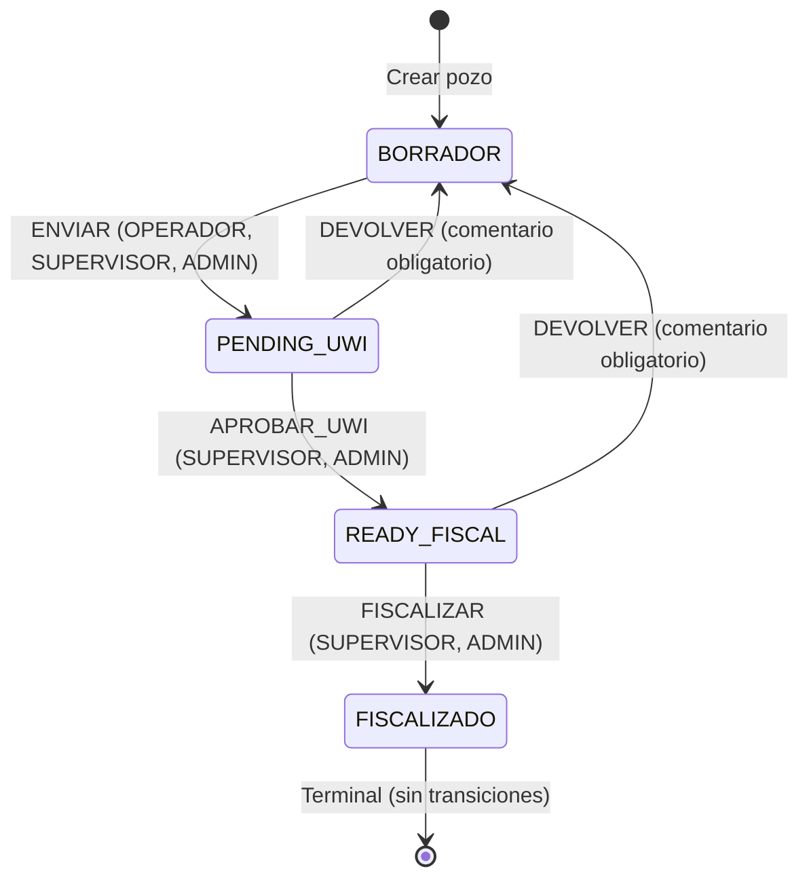

# Módulo de Gestión de Pozos — GOP 360°

**Versión:** 1.0  
**Fecha:** 2026-04-17  
**Estado:** Producción (Post-QA Audit)  
**Dominio:** `src/app/domains/wells` (frontend), `GOP.API/Features/Wells` (backend)

---

## 1. Visión General

El **módulo de Gestión de Pozos** implementa el ciclo de vida completo de un pozo (Well) en el sistema GOP 360°, alineado con la regulación de la Agencia Nacional de Hidrocarburos (ANH) de Colombia.

### Contexto ANH

Un pozo (well) es la unidad operativa fundamental en exploración y producción de hidrocarburos. El sistema GOP 360 rastrea los pozos desde su concepto en **estado borrador** hasta su **fiscalización definitiva**, asignando un identificador único (UWI) según el formato ANH y manteniendo un historial inmutable de todas las transiciones de estado.

### Cobertura Funcional

| Aspecto | Iteraciones | Estado |
|---------|------------|--------|
| CRUD básico (crear, leer, actualizar, eliminar borradores) | 005 | ✅ Completo |
| Formulario wizard multi-paso con cascadas reactivas | 006 | ✅ Completo |
| Máquina de estados (BORRADOR → FISCALIZADO) | 007 | ✅ Completo |
| Generación automática de UWI (ANH Colombia) | 007 | ✅ Completo |
| Historial inmutable de transiciones | 007 | ✅ Completo |
| RBAC por transición (ADMIN, SUPERVISOR, OPERADOR, AUDITOR) | 005–007 | ✅ Completo |
| Multi-tenancy automático por operadora | 005–007 | ✅ Completo |

---

## 2. Modelo de Datos

### 2.1. Entidad Well (Pozo)

```typescript
// Interface TS (Frontend — modelo de dominio)
export interface Well {
  id: Guid;                          // UUID v4
  
  // Identificación
  nombrePozo: string;                // {cuenca}-{denominacion}-{consecutivo}
  operadora: string;                 // TenantName — auto asignada
  uwi?: string;                      // UWI ANH (null si en BORRADOR)
  
  // Contrato y Ubicación Contractual
  contratoId: number;                // FK a Contrato
  contrato: string;                  // Nombre del contrato (denorm)
  tipoContrato: string;              // E&P, TEA, etc. (derivado del contrato)
  cuenca: string;                    // Nombre cuenca (derivado del contrato)
  
  campoId: number;                   // FK a Campo
  campo: string;                     // Nombre del campo (denorm)
  
  // Denominación y Nomenclatura
  denominacion: string;              // Nombre del pozo (sin números)
  consecutivo: string;               // 2 dígitos: 01–99
  
  // Datos Técnicos
  tipoTrayectoria: string;           // ST, P, PR, ML, G, O
  clasificacion: string;             // EXPLORATORIO, DESARROLLO, ESTRATIGRAFICO
  tipoUbicacion: string;             // CONTINENTAL, COSTA_FUERA
  tipoAngulo: string;                // H (Horizontal), V (Vertical), D (Direccional)
  tipoObjetivo: string;              // PH, I, M, D
  tipoTerminacion: string;           // CD, LC, LR, GP, CC, OH, O
  
  // Ubicación Geográfica
  ubicacion: {
    departamentoId: number;
    departamento: string;
    codigoDaneDpto: string;          // Código DANE (p.ej. "50" para Meta)
    municipioId: number;
    municipio: string;
    codigoDaneMpio: string;          // Código DANE (p.ej. "50568" para Puerto Gaitán)
    clusterId?: number;
    cluster?: string;
  };
  
  // Estado y Auditoría
  estado: WellStatus;                // BORRADOR, PENDING_UWI, READY_FISCAL, FISCALIZADO
  tenantId: number;                  // FK a Operator — auto asignada del JWT
  isDeleted: boolean;                // Soft delete
  createdAt: Date;                   // UTC
  lastModifiedAt?: Date;
}
```

### 2.2. Enum WellStatus

```csharp
public enum WellStatus
{
  [Display(Name = "Borrador")]
  Borrador,
  
  [Display(Name = "Pendiente UWI")]
  PendingUwi,
  
  [Display(Name = "Listo Fiscal")]
  ReadyFiscal,
  
  [Display(Name = "Fiscalizado")]
  Fiscalizado
}
```

### 2.3. Entidades Catálogo

```
┌─────────────┐
│  Contrato   │  id, nombre, tipo (E&P, TEA), cuenca
├─────────────┤
     │ 1:N
     │
┌────┴────┐    ┌──────────────┐
│ Campo   │    │ Departamento │  id, nombre, codigoDane
└────┬────┘    └──────┬───────┘
     │ 1:N             │ 1:N
     │            ┌────┴────┐
┌────┴────┐       │Municipio│  id, nombre, codigoDane
│ Cluster │       └─────────┘
└─────────┘
```

**Datos Seed (3 contratos, 6 campos, 3 departamentos, 6 municipios, 4 clusters)** — Ver `spec.md` HU-025 Sección 5 para lista completa.

### 2.4. Entidad de Historial (WellTransitionHistory)

```csharp
public class WellTransitionHistory : Entity
{
  public Guid WellId { get; init; }              // FK
  public WellStatus FromState { get; init; }     // Estado anterior
  public WellStatus ToState { get; init; }       // Estado nuevo
  public string Action { get; init; }            // ENVIAR, APROBAR_UWI, DEVOLVER, FISCALIZAR
  public string? Comment { get; init; }          // Motivo (DEVOLVER) o null
  public Guid PerformedBy { get; init; }         // Usuario ID
  public string PerformedByName { get; init; }   // Nombre usuario
  public string PerformedByRole { get; init; }   // Rol usuario
  public DateTime CreatedAt { get; init; }       // UTC, auto-asignada
  public bool IsDeleted { get; init; }           // Soft delete (aunque historial es inmutable)
}
```

---

## 3. Reglas de Negocio Activas

### 3.1. Creación y Borrador (Iter 005)

| Regla | Descripción |
|-------|------------|
| RN-030 | `nombrePozo` se calcula: `{cuenca}-{denominacion}-{consecutivo}`. No se envía en request; se calcula en backend. |
| RN-031 | `operadora` se auto-llena con `tenantName` del JWT. No es editable. |
| RN-032 | `tenantId` se asigna automáticamente del JWT. Nunca del body. |
| RN-033 | Solo pozos en estado `BORRADOR` pueden editarse o eliminarse. |
| RN-034 | Catálogos son read-only. No hay endpoints de escritura. |
| RN-035 | `denominacion` solo acepta letras (sin números ni especiales), máx 50 caracteres. |
| RN-036 | `consecutivo` es numérico de exactamente 2 dígitos (01–99). |
| RN-037 | Campos derivados (`tipoContrato`, `cuenca`, códigos DANE) se resuelven en backend desde FKs. |
| RN-038 | Filtro multi-tenant automático: OPERADOR y SUPERVISOR ven solo su tenant. ADMIN ve todos. AUDITOR ve todos (RO). |
| RN-040 | Eliminación es siempre soft delete (`IsDeleted = true`). |

### 3.2. Máquina de Estados (Iter 007)

| Regla | Descripción |
|-------|------------|
| RN-070 | UWI se genera automáticamente al ejecutar ENVIAR. Frontend no puede enviar/modificar UWI. |
| RN-071 | Denominación se convierte a UPPERCASE en el UWI. |
| RN-072 | Si pozo ya tiene UWI (re-envío post-devolución), se preserva el existente sin regenerar. |
| RN-073 | UWI debe ser único. Duplicado genera `409 Conflict`. |
| RN-074 | MaxLength del UWI: 50 caracteres. |
| RN-075 | DEVOLVER siempre requiere comentario (mínimo 10, máximo 500 caracteres). |
| RN-076 | Solo pozos en `BORRADOR` pueden editarse (PUT) o eliminarse (DELETE). |
| RN-077 | `FISCALIZADO` es estado terminal: no admite transiciones ni modificación. |
| RN-078 | Al ejecutar ENVIAR, todos los campos requeridos deben estar completos. Si faltan: `422` con campos faltantes. |
| RN-079 | Cada transición genera registro inmutable en historial (nunca elimina ni edita). |
| RN-081 | OPERADOR solo ejecuta ENVIAR sobre pozos de su propio tenant. Multi-tenant aplica. |
| RN-082 | AUDITOR no puede ejecutar ninguna transición. Solo consulta. |

### 3.3. Cascadas Reactivas (Iter 006)

| Cascada | Obligatoria | Efecto de cambio padre |
|---------|------------|----------------------|
| Contrato → (cuenca, tipoContrato, campos) | Sí | Campos se limpian si no válidos |
| Campo → Cluster | No | Cluster se limpia si no válido |
| Departamento → Municipios | Sí | Municipio se limpia si no válido |

---

## 4. Máquina de Estados

### 4.1. Diagrama Mermaid



### 4.2. Tabla de Transiciones Válidas

| Estado | Acción | → Estado | Roles | Comentario | Efecto |
|--------|--------|----------|-------|-----------|--------|
| BORRADOR | ENVIAR | PENDING_UWI | ADMIN, SUPERVISOR, OPERADOR | No | Genera UWI |
| PENDING_UWI | APROBAR_UWI | READY_FISCAL | ADMIN, SUPERVISOR | No | Ninguno |
| PENDING_UWI | DEVOLVER | BORRADOR | ADMIN, SUPERVISOR | **Sí (requerido)** | Preserva UWI |
| READY_FISCAL | FISCALIZAR | FISCALIZADO | ADMIN, SUPERVISOR | No | Ninguno |
| READY_FISCAL | DEVOLVER | BORRADOR | ADMIN, SUPERVISOR | **Sí (requerido)** | Preserva UWI |

---

## 5. Formato UWI — ANH Colombia

### 5.1. Patrón

```
CO-{daneDpto}-{daneMpio}-{denominacion}-{consecutivo}-{trayectoria}
```

### 5.2. Ejemplo

Pozo "ALPHA", consecutivo "01", trayectoria "ST", ubicado en Puerto Gaitán (DANE 50568), Meta (DANE 50):

```
CO-50-50568-ALPHA-01-ST
```

### 5.3. Reglas de Generación

- Se genera automáticamente en backend al ejecutar transición ENVIAR
- Denominación se convierte a UPPERCASE
- Si pozo ya tiene UWI, se preserva (no regenera)
- Debe ser único en todo el sistema
- MaxLength: 50 caracteres

---

## 6. API Endpoints

### 6.1. Endpoints de CRUD (Iter 005)

| Operación | Método | Ruta | Roles | Descripción |
|-----------|--------|------|-------|------------|
| Listar pozos | GET | `/api/v1/wells` | ADMIN, SUPERVISOR, OPERADOR, AUDITOR | Paginado + filtros |
| Crear pozo | POST | `/api/v1/wells` | ADMIN, SUPERVISOR, OPERADOR | Crea en BORRADOR |
| Detalle pozo | GET | `/api/v1/wells/{id}` | ADMIN, SUPERVISOR, OPERADOR, AUDITOR | Todos los datos |
| Actualizar pozo | PUT | `/api/v1/wells/{id}` | ADMIN, SUPERVISOR, OPERADOR | Solo BORRADOR |
| Eliminar pozo | DELETE | `/api/v1/wells/{id}` | ADMIN, SUPERVISOR, OPERADOR | Soft delete, solo BORRADOR |

### 6.2. Endpoints de Catálogos (Iter 005)

| Ruta | Parámetros | Respuesta | Descripción |
|------|-----------|----------|------------|
| `GET /catalogs/contratos` | — | Array `ContratoItem[]` | Todos los contratos |
| `GET /catalogs/campos` | `contratoId` | Array `CampoItem[]` | Campos del contrato |
| `GET /catalogs/departamentos` | — | Array `DepartamentoItem[]` | Todos los departamentos |
| `GET /catalogs/municipios` | `departamentoId` | Array `MunicipioItem[]` | Municipios del departamento |
| `GET /catalogs/clusters` | `campoId` | Array `ClusterItem[]` | Clusters del campo |

### 6.3. Endpoints de Transiciones (Iter 007)

| Operación | Método | Ruta | Roles | Descripción |
|-----------|--------|------|-------|------------|
| Transicionar | PATCH | `/api/v1/wells/{id}/transition` | ADMIN, SUPERVISOR, OPERADOR | Cambio de estado |
| Historial | GET | `/api/v1/wells/{id}/history` | Todos | Transiciones inmutables |

### 6.4. Endpoints Auxiliares (Iter 006)

| Operación | Método | Ruta | Roles | Descripción |
|-----------|--------|------|-------|------------|
| Preview nombre | GET | `/api/v1/wells/preview-name` | ADMIN, SUPERVISOR, OPERADOR | Calcula nombre + verifica disponibilidad |

---

## 7. Flujos de Usuario Principales

### 7.1. Crear Pozo (Happy Path)

```
[OPERADOR en /wells/create]
  ↓
1. Wizard Paso 1: Información del Contrato
   - Selecciona Contrato (cascada → campos derivados, Campos)
   - Selecciona Campo (cascada → Clusters)
   - Selecciona Clasificación
   - Ingresa Denominación (solo letras)
   - Ingresa Consecutivo (2 dígitos)
   - Sistema calcula preview: "{cuenca}-{denominacion}-{consecutivo}"
   - GET /catalogs/preview-name → verificar disponibilidad
   ↓
2. Wizard Paso 2: Datos Técnicos
   - Selecciona Tipo Trayectoria
   - Selecciona Tipo Ubicación
   - Selecciona Tipo Ángulo
   - Selecciona Tipo Objetivo
   - Selecciona Tipo Terminación
   ↓
3. Wizard Paso 3: Ubicación Geográfica
   - Selecciona Departamento (cascada → Municipios)
   - Selecciona Municipio
   - (Cluster ya fue seleccionado en Paso 1, se muestra RO)
   ↓
4. Wizard Paso 4: Resumen y Confirmación
   - Review de todos los datos
   - Botón "Guardar Borrador"
   - POST /api/v1/wells → 201 Created
   ↓
5. Toast éxito + Navegación a /wells/manage
```

### 7.2. Transicionar Pozo (Happy Path)

```
[OPERADOR ve pozo en BORRADOR]
  ↓
  Botón "Enviar para UWI"
  ↓
  PATCH /api/v1/wells/{id}/transition {"action": "ENVIAR"}
  ↓
  Backend:
    1. Valida que pozo esté en BORRADOR
    2. Valida que todos los campos requeridos estén completos
    3. Genera UWI: CO-{daneDpto}-{daneMpio}-{denominacion}-{consecutivo}-{trayectoria}
    4. Verifica que UWI sea único
    5. Cambia estado a PENDING_UWI
    6. Crea registro en WellTransitionHistory
    7. Retorna 200 con bien actualizado
  ↓
  Frontend: Toast éxito + Badge de estado cambia a "Pendiente UWI"
  ↓
[SUPERVISOR ve pozo en PENDING_UWI]
  ↓
  Botones: "Aprobar UWI" o "Devolver a Borrador"
  ↓
  Si "Aprobar UWI":
    PATCH /api/v1/wells/{id}/transition {"action": "APROBAR_UWI"}
    → Estado cambia a READY_FISCAL
  ↓
  Si "Devolver a Borrador":
    Diálogo con textarea "Motivo de devolución" (mín 10 char)
    PATCH /api/v1/wells/{id}/transition {"action": "DEVOLVER", "comment": "..."}
    → Estado cambia a BORRADOR, UWI se preserva
```

### 7.3. Consultar Historial

```
[Cualquier rol en /wells/{id}]
  ↓
  GET /api/v1/wells/{id}/history
  ↓
  Retorna array de transiciones (descendente por fecha):
  [
    {
      id: UUID,
      fromState: "PENDING_UWI",
      toState: "BORRADOR",
      action: "DEVOLVER",
      comment: "Denominación incorrecta...",
      performedBy: UUID,
      performedByName: "María Gómez",
      performedByRole: "SUPERVISOR",
      createdAt: "2024-11-16T10:00:00Z"
    },
    ...
  ]
  ↓
  Frontend: Timeline visual con badge de acción, usuario, fecha y comentario
```

---

## 8. Arquitectura del Código

### 8.1. Backend (Clean Architecture)

```
GOP.Domain
├── Entities/
│   ├── Well.cs                          # Entidad raíz del agregado
│   └── WellTransitionHistory.cs         # Historial inmutable
├── ValueObjects/
│   └── UWI.cs                           # UWI como value object (opcional)
├── Enums/
│   ├── WellStatus.cs                    # BORRADOR, PENDING_UWI, READY_FISCAL, FISCALIZADO
│   ├── TipoTrayectoria.cs
│   ├── Clasificacion.cs
│   └── (otros tipos)
├── Errors/
│   └── DomainErrors.Well.cs             # Errores de dominio (NotFound, InvalidStatus, etc.)
└── Interfaces/
    └── IWellRepository.cs               # Contrato de persistencia

GOP.Application
├── Features/Wells/
│   ├── Commands/
│   │   ├── CreateWell/
│   │   │   ├── CreateWellCommand.cs
│   │   │   ├── CreateWellCommandHandler.cs
│   │   │   └── CreateWellCommandValidator.cs
│   │   ├── UpdateWell/
│   │   ├── DeleteWell/
│   │   └── TransitionWell/
│   │       ├── TransitionWellCommand.cs
│   │       ├── TransitionWellCommandHandler.cs
│   │       └── TransitionWellCommandValidator.cs
│   ├── Queries/
│   │   ├── GetWellById/
│   │   ├── GetWellsList/
│   │   ├── GetWellHistory/
│   │   └── PreviewWellName/
│   └── Mappings/
│       └── WellMappingProfile.cs

GOP.Infrastructure
├── Persistence/
│   ├── Configurations/
│   │   ├── WellConfiguration.cs
│   │   └── WellTransitionHistoryConfiguration.cs
│   └── Repositories/
│       └── WellRepository.cs

GOP.API
├── Controllers/
│   ├── WellsController.cs               # Endpoints CRUD + transiciones
│   └── CatalogsController.cs            # Endpoints catálogos
└── Contracts/
    ├── CreateWellRequest.cs
    ├── UpdateWellRequest.cs
    └── TransitionWellRequest.cs
```

**Características arquitectónicas:**
- CQRS: Commands para escritura (CreateWell, UpdateWell, TransitionWell), Queries para lectura
- Result Pattern: sin excepciones en flujo de negocio; errores como `Result.Failure(error)`
- MediatR Pipeline: LoggingBehavior, ValidationBehavior, AuthorizationBehavior
- EF Core Fluent API: query filters de soft-delete, multi-tenant automático
- Repository Pattern: IWellRepository implementado en WellRepository

### 8.2. Frontend (Domain-Driven Design + Standalone Components)

```
src/app/domains/wells/
├── components/
│   ├── well-status-badge.component.ts   # UI agnóstica (color según estado)
│   └── well-status-dropdown.component.ts # Catálogo de estados
├── features/
│   ├── well-create/
│   │   ├── components/
│   │   │   ├── step-contract-info.component.ts
│   │   │   ├── step-technical-data.component.ts
│   │   │   ├── step-location.component.ts
│   │   │   └── step-summary.component.ts
│   │   ├── well-create.component.ts     # Wizard controller (Smart)
│   │   ├── well-create.component.html
│   │   ├── well-create.component.spec.ts
│   │   └── locale.ts                    # Textos del wizard
│   ├── well-manage/
│   │   ├── well-manage.component.ts     # Listado + filtros (Smart)
│   │   └── well-manage.component.html
│   ├── well-detail/
│   │   ├── components/
│   │   │   └── well-history-timeline.component.ts
│   │   ├── well-detail.component.ts     # Detalle + acciones (Smart)
│   │   ├── well-detail.component.html
│   │   └── well-detail.component.spec.ts
│   └── (other features)
├── models/
│   ├── well.model.ts                    # Interfaz Well (camelCase)
│   ├── well-list-item.model.ts
│   ├── well-detail.model.ts
│   ├── well.dto.ts                      # Interfaz WellDTO (snake_case del API)
│   └── well.mapper.ts                   # DTO → Model
├── services/
│   ├── wells-api.service.ts             # Llamadas HTTP a /api/v1/wells
│   └── catalogs-api.service.ts          # Llamadas HTTP a /api/v1/catalogs
├── store/                               # NgRx Feature State
│   ├── wells.actions.ts
│   ├── wells.reducer.ts
│   ├── wells.selectors.ts
│   └── wells.effects.ts
└── wells.routes.ts                      # Rutas lazy-loaded del dominio
```

**Características arquitectónicas:**
- Standalone Components: sin NgModules
- Smart (contenedores) vs Dumb (presentación): separación estricta
- NgRx para estado global (wells CRUD, catálogos), Signals para estado local (pasos del wizard)
- Lazy loading: dominio se carga bajo demanda desde `app.routes.ts`
- Cascadas reactivas: `combineLatest()` + `switchMap()` para filtrado dependiente
- Mappers: DTO (snake_case) → Model (camelCase)

---

## 9. Testing

### 9.1. Cobertura Backend (Iter 005–007)

| Capa | Tests | Escenarios | Estado |
|------|-------|-----------|--------|
| Domain | 21 | Well entity, state transitions, UWI generation | ✅ Completo |
| Application Commands | 16 | CreateWell (4), UpdateWell (4), DeleteWell (4), TransitionWell (8) | ⚠️ Faltan UpdateWell y DeleteWell |
| Application Queries | 10 | GetWellsList (3), GetWellById, GetWellHistory (3), PreviewWellName (4) | ⚠️ Faltan GetWellById |
| API Integration | 15 | Endpoints CRUD, state transitions, error cases | ⚠️ EF InMemory (no Testcontainers) |

**Total Backend: 80 tests**

**Escenarios de cobertura por regla de negocio:**
- ✅ Multi-tenant: GetWellsList solo retorna pozo del tenant del usuario
- ✅ Soft delete: DELETE marca IsDeleted=true, query filter excluye
- ✅ Cascadas: CREATE falsa si FK inválido
- ✅ Estado terminal: FISCALIZADO rechaza transiciones
- ✅ UWI: generación automática, unicidad, preservación post-devolución
- ⚠️ PUT/DELETE en no-BORRADOR: sin tests unitarios (solo integration)

### 9.2. Cobertura Frontend

| Componente | Tests | Estado |
|-----------|-------|--------|
| well-create.component.ts | Incluidos en app.spec.ts | ❌ Rotos (No provider Store) |
| well-manage.component.ts | — | ❌ No implementados |
| well-detail.component.ts | — | ❌ No implementados |
| wells-api.service.ts | — | ❌ No implementados |

**Recomendación:** Implementar tests unitarios post-QA para componentes smart (inyectar mock Store, mock ApiService).

### 9.3. E2E (No implementado)

Pendiente para iteración posterior: Playwright/Cypress scenarios cobriendo happy paths de creación, transiciones y historial.

---

## 10. Datos de Prueba (Seed)

### 10.1. Usuarios Autenticados

| Email | Password | Nombre | Rol | Tenant |
|-------|----------|--------|-----|--------|
| `admin@gop.co` | `Admin123*` | Administrador ANH | ADMIN | 1 (ANH) |
| `supervisor@gop.co` | `Super123*` | Supervisor Ecopetrol | SUPERVISOR | 2 (Ecopetrol) |
| `operador@gop.co` | `Oper123*` | Operador Ecopetrol | OPERADOR | 2 (Ecopetrol) |
| `auditor@gop.co` | `Audit123*` | Auditor ANH | AUDITOR | 1 (ANH) |

### 10.2. Catálogos

- **3 Contratos:** E&P Llanos, TEA Magdalena, E&P Putumayo
- **6 Campos:** Rubiales, Castilla, La Cira, Infantas, Orito, San Miguel
- **3 Departamentos:** Meta, Santander, Putumayo
- **6 Municipios:** Puerto Gaitán, Acacías, Barrancabermeja, San Vicente de Chucurí, Orito, Puerto Asís
- **4 Clusters:** Cluster Norte, Cluster Sur, Cluster Central, Cluster Occidental

---

## 11. Dependencias Externas

### 11.1. Backend (.NET 10)

| Paquete | Versión | Propósito |
|---------|---------|----------|
| MediatR | 12.x | CQRS dispatch |
| FluentValidation | 11.x | Validación de commands |
| AutoMapper | 13.x | Entity → DTO mapping |
| EF Core | 10.x | ORM |
| Serilog | 9.x | Structured logging |

### 11.2. Frontend (Angular 18)

| Paquete | Versión | Propósito |
|---------|---------|----------|
| @ngrx/store | 18.x | Estado global |
| @ngrx/effects | 18.x | Side effects (HTTP, navegación) |
| primeng | 21.x | Componentes UI (Stepper, Table, Dialog, etc.) |
| tailwindcss | 3.x | Utilidades CSS |
| @angular/forms | 18.x | Forms reactivos |

---

## 12. Próximas Iteraciones (Backlog)

| Iteración | Feature | Descripción |
|-----------|---------|------------|
| 8 | Producción Module | CRUD de registros de producción por pozo |
| 9 | Operaciones Module | Programación y seguimiento de actividades |
| 10 | Auditoría | Registro y reporte de acciones de usuario |
| Future | Microservicios | Extracción de Auth, Wells, Production a servicios independientes |

---

## 13. Links Útiles

- **Especificación Funcional:** `specs/features/005-wells-catalog-crud/spec.md` (CRUD)
- **Especificación Funcional:** `specs/features/006-well-creation-form/spec.md` (Wizard)
- **Especificación Funcional:** `specs/features/007-well-state-machine/spec.md` (Estado Machine)
- **Contratos OpenAPI:** `specs/features/00X-*/contract.yml` (405, 006, 007)
- **Constitución Backend:** `CONSTITUTION.backend.md`
- **Constitución Frontend:** `CONSTITUTION.md`
- **QA Report:** `QA-REPORT.md` (auditoría post-implementación)

---

**Documento generado por GOP-Docs — 2026-04-17**
